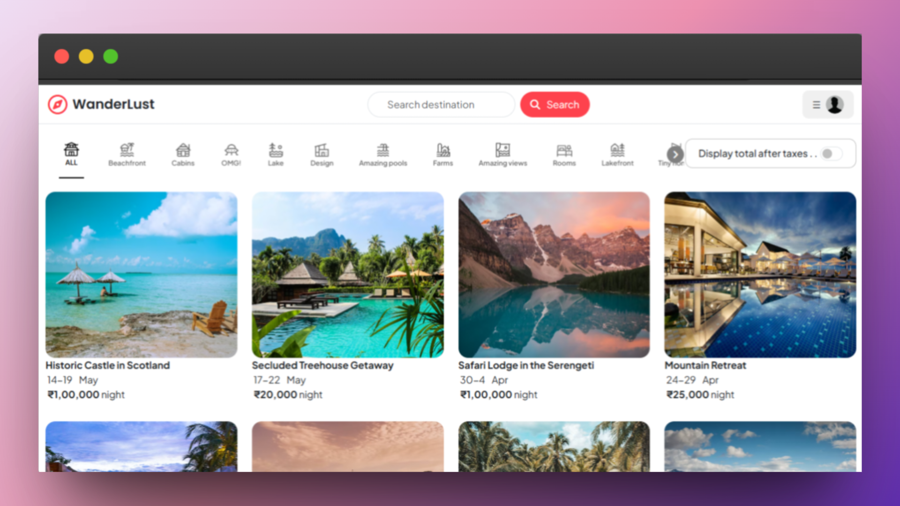

# WanderLust



## Overview

WanderLust is a full-stack accommodation booking platform inspired by modern travel rental marketplaces. It lets users explore stays, filter listings by category, view location details on an interactive map, create their own listings, and make bookings through a clean server-rendered interface.

The project also includes:

- user authentication with Passport.js and session-based login
- Cloudinary-powered image uploads for listing photos
- Mapbox geocoding and map display for property locations
- booking management with date-conflict checking
- profile pages for managing personal bookings and owned listings

## Features

- **Browse Listings:** View all available stays in a responsive card-based layout.
- **Search and Filter:** Find listings by country and category from the homepage.
- **Create and Manage Listings:** Logged-in users can add, edit, and delete their own properties.
- **Image Uploads:** Listing images are uploaded with Multer and stored in Cloudinary.
- **Map Integration:** Each listing includes geocoded coordinates and a Mapbox map preview.
- **Booking Flow:** Users can book stays by selecting dates, guests, and contact details.
- **Booking Conflict Check:** Prevents overlapping bookings for the same listing.
- **User Accounts:** Signup, login, logout, and persistent sessions with Passport Local.
- **Profile Dashboard:** Users can review their profile, bookings, and owned listings in one place.
- **Tax Toggle UI:** Listing cards can switch between base price and tax-inclusive pricing.

## Tech Stack

- **Node.js**: JavaScript runtime used to run the server.
- **Express.js**: Backend framework for routes, middleware, and request handling.
- **EJS**: Server-side templating with layout support.
- **MongoDB**: Database and ODM for users, listings, and bookings.
- **Passport.js**: Authentication and session-based login handling.
- **Express Session**: Session storage backed by MongoDB.
- **Cloudinary**: Image upload pipeline for listing photos.
- **Mapbox SDK**: Geocoding and interactive map rendering.
- **Joi**: Request payload validation for listing forms.
- **Bootstrap**: UI styling, filters, and booking interactions.

## Core Modules

- **Listings:** CRUD operations for rental listings, including image upload and geocoding.
- **Bookings:** Booking creation with overlap validation and booking detail pages.
- **Users:** Account registration, authentication, and profile management.
- **Middleware:** Authentication guard, ownership checks, redirect handling, and validation.
- **Seed Data:** Starter listing dataset and initialization script for local setup.

## Getting Started

To run this project locally, follow these steps.

### Prerequisites

- **Node.js** 20.16.0 or higher
- **npm**
- A **MongoDB** database connection string
- A **Cloudinary** account for image uploads
- A **Mapbox** access token for geocoding and maps

## Installation

1. **Clone the repository**

   ```bash
   git clone https://github.com/udayxgoel/WanderLust.git
   cd WanderLust
   ```

2. **Install dependencies**

   ```bash
   npm install
   ```

3. **Set up environment variables**

   Create a `.env` file in the root directory and add:

   ```env
   PORT=4000
   MONGODB_URL=your_mongodb_connection_string
   CLOUD_NAME=your_cloudinary_cloud_name
   CLOUD_API_KEY=your_cloudinary_api_key
   CLOUD_API_SECRET=your_cloudinary_api_secret
   MAP_TOKEN=your_mapbox_access_token
   SECRET=your_session_secret
   ```

4. **Optional: seed the database**

   ```bash
   node init/index.js
   ```

5. **Start the server**

   ```bash
   npm start
   ```

6. **Open the app**

   Visit [http://localhost:4000](http://localhost:4000)

## Usage

### Running the App

- **Production/server start:** `npm start`
- **Database seed:** `node init/index.js`

### Main Routes

- `GET /listings` - browse all listings
- `GET /listings/search?country=...` - search listings by country
- `GET /listings/filter/:id` - filter listings by category
- `GET /listings/new` - create listing form
- `GET /listings/:id` - listing details page
- `POST /listings` - create a new listing
- `PUT /listings/:id` - update an existing listing
- `DELETE /listings/:id` - delete a listing
- `POST /bookings` - create a booking
- `GET /bookings/:id` - view booking details
- `GET /user/signup` - signup page
- `GET /user/login` - login page
- `GET /user/profile` - user profile dashboard

### Listing Creation Flow

When a user creates a listing, the app:

1. uploads the selected image to Cloudinary
2. geocodes the provided address using Mapbox
3. stores owner, image, location, and listing details in MongoDB

### Booking Flow

When a user books a listing, the app:

1. checks for overlapping bookings on the same property
2. stores the booking with user and listing references
3. redirects to a booking confirmation/details page

## Contributing

Contributions are welcome.

1. Fork the repository
2. Create a branch: `git checkout -b feature/your-feature-name`
3. Make your changes
4. Commit: `git commit -m "Add your feature"`
5. Push: `git push origin feature/your-feature-name`
6. Open a pull request

## Issues

If you find a bug or setup issue, please open an issue with:

- a clear title
- a short description of the problem
- steps to reproduce
- screenshots or logs if relevant
- your environment details

## License

This project is currently licensed under **ISC**, as defined in `package.json`.
